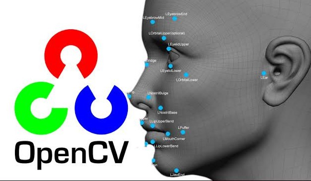
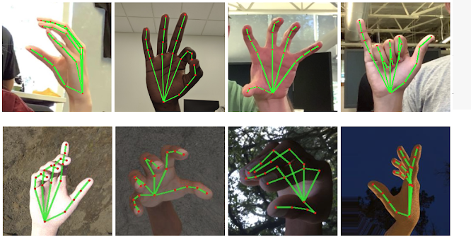

# programmers4u
Dinosaur game with gesture controls. Sounds crazy, right?

## Gra - Dinosaur adventure game + sterowanie za pomocą gestów, położenia dłoni itp. 

OpenCV  
 <picture align="center">
  
</picture>

[Rock paper scisors](https://www.computervision.zone/courses/rock-paper-scissor/) 
[Tutorial py root](https://docs.opencv.org/4.x/d6/d00/tutorial_py_root.html) 

jest to oparty na sztucznej inteligencji (ML) (Baza danych - zdjęcia dłoni) system rozpoznawania gestów dłoni, mimikę twarzy, ruchy kończyn - do ich rozpoznawania program korzysta z kamerki użytkownika.

 <picture align="center">
  
</picture>

**Planujemy stworzyć grę o zasadach podobnych do zasad “Dinosaur adventure game”, ale z wykorzystaniem detekcji gestów dłoni do sterowania naszym dinozaurem.**

 <picture align="center">
  
</picture>

### Narzędzia informatyczne - Projekt grupy Programmers4u ###
Kim jesteśmy ? Jesteśmy młodymi i ambitnymi studentami pierwszego roku na kierunku informatyka i systemy inteligentne. Połączyła nas wspólna pasja jaką jest programowanie i sztuczna inteligencja. Owe pasje chcemy przekuć w ciekawe projekty takie jak ten, którym będzie gra Trex sterowana gestami rąk.
### Główne zalety naszego projektu:
- Połączenie programowania ze sztuczną inteligencją
- Nauka Pythona
- Użycie ciekawych bibliotek
- Integracja i praca w grupie
### Jakie są nasze priorytety ?
1. Kreatywność
2. Współpraca
3. Wzajemna pomoc

| Członkowie zespołu        | 
| -------------             |
| J.Majchrowicz             | 
| M.Porębski                |                     
| J.Biernat                 | 
| A.Marczyk                 |
| K.Baumgart                |
| P.Bieszczad               |

***Dinosaur Adventure jest moją ulubioną grą dzieciństwa,
a gdyby można było sterować gestami dłoni-
to dopiero byłby kosmos!***
>Albert Einstein

  
